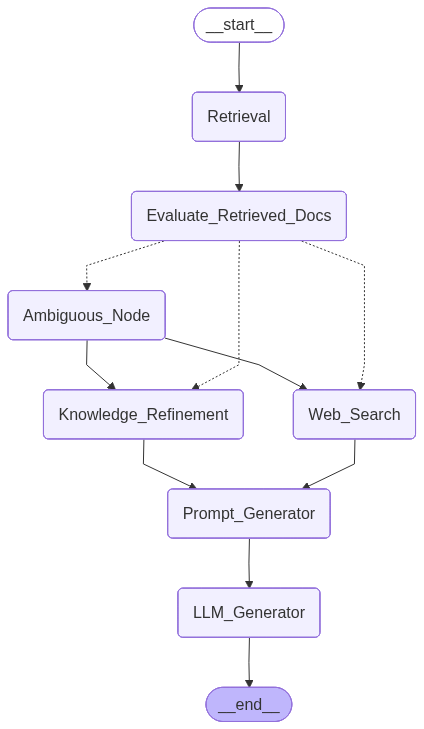

# Biomedical Multi-Agent Research Assistant

A production-grade biomedical research assistant built with LangGraph and LangChain, capable of retrieving scientific literature, evaluating document relevance, performing corrective retrieval, and generating grounded answers with citations.

## Overview

This project implements a **Corrective RAG (CRAG)** pipeline for biomedical literature question answering, focused on cell-free DNA (cfDNA) methylation and cancer detection research. The system goes beyond simple retrieval-augmented generation by evaluating document quality and correcting retrieval when needed — either through knowledge refinement or web search fallback.

## Architecture



```
User Query
    ↓
Retrieval (MMR from ChromaDB)
    ↓
Evaluate Retrieved Docs (LLM Grader)
    ↓
┌─────────────────────────────────────┐
│  CORRECT   │  AMBIGUOUS  │INCORRECT │
└─────────────────────────────────────┘
     ↓              ↓↓           ↓
Knowledge    KR + WebSearch   Web Search
Refinement   (parallel)      + Query Rewrite
     ↓              ↓            ↓
          Prompt Generator
                ↓
          LLM Generator
                ↓
         Final Answer
```

### CRAG Routing Logic

| Verdict | Condition | Action |
|---|---|---|
| CORRECT | Any doc scores > 0.7 | Knowledge Refinement on correct docs |
| AMBIGUOUS | Mix of relevant and irrelevant | Knowledge Refinement + Web Search in parallel |
| INCORRECT | All docs score < 0.3 | Query rewrite + Web Search only |

## Key Components

### `rag/ingest.py`
- Loads biomedical PDFs using `PyPDFLoader` with lazy loading
- Chunks documents with `RecursiveCharacterTextSplitter` (chunk size: 500, overlap: 100)
- Embeds using OpenAI `text-embedding-3-small`
- Persists to ChromaDB vector store

### `rag/query.py`
- **Retrieval** — MMR search (k=5, fetch_k=20) from ChromaDB
- **Evaluate Retrieved Docs** — LLM grades each chunk 0.0–1.0 with structured output, classifies into CORRECT / AMBIGUOUS / INCORRECT
- **Knowledge Refinement** — Decomposes docs into sentence-level strips, filters irrelevant strips via LLM boolean grader, recomposes clean context
- **Web Search** — Rewrites query for web search, fetches via Tavily, filters strips from web results
- **Prompt Generator** — Builds structured system + human messages with inline citations
- **LLM Generator** — Generates final grounded answer with source attribution

## Tech Stack

- **LangGraph** — Graph-based agent orchestration with typed state, conditional routing, parallel execution
- **LangChain** — Document loaders, text splitters, prompt templates, retrieval
- **ChromaDB** — Persistent vector store
- **OpenAI** — `text-embedding-3-small` for embeddings, `gpt-4o-mini` for grading and generation
- **Tavily** — Web search fallback for corrective retrieval
- **Pydantic** — Structured LLM outputs (`ScoreDocs`, `StripBools`, `RewrittenQuery`)

## Domain

Papers indexed cover **cfDNA methylation for cancer detection and tissue-of-origin (TOO)** classification:

- Cell-free DNA methylation-based methods in oncology
- Multimodal cfDNA whole-methylome sequencing for cancer detection
- Fragmentation landscape of cfDNA (end motif analysis)
- cfDNA methylation for multi-cancer early detection

## Project Structure

```
project/
├── rag/
│   ├── ingest.py              # PDF ingestion, chunking, embedding
│   ├── query.py               # CRAG query pipeline
│   └── Biomedical_RAG_workflow.png
├── agents/                    # Phase 3 — coming soon
├── tools/                     # Phase 4 — coming soon
├── mcp/                       # Phase 4 — coming soon
├── api/                       # Phase 6 — coming soon
├── data/                      # PDF papers + ChromaDB (gitignored)
├── .gitignore
└── README.md
```

## Setup

```bash
# Install dependencies
pip install langchain langchain-community langchain-chroma langchain-openai \
            langchain-tavily langgraph pydantic python-dotenv

# Set environment variables
cp .env.example .env
# Add OPENAI_API_KEY and TAVILY_API_KEY to .env

# Ingest papers (place PDFs in data/ first)
cd rag
python ingest.py

# Run a query
python query.py
```

## Roadmap

- [x] Phase 1 — Basic RAG (ingestion, chunking, embeddings, retrieval)
- [x] Phase 2 — CRAG (document grading, knowledge refinement, web search fallback, conditional routing)
- [ ] Phase 3 — Multi-Agent System (Planner, Retrieval, Evidence Extraction, Validation, Summarization agents)
- [ ] Phase 4 — MCP Integration (PubMed, Arxiv, Citation formatter, Gene database)
- [ ] Phase 5 — Observability (LangSmith tracing, hallucination analysis)
- [ ] Phase 6 — API & Deployment (FastAPI, Docker, docker-compose)
